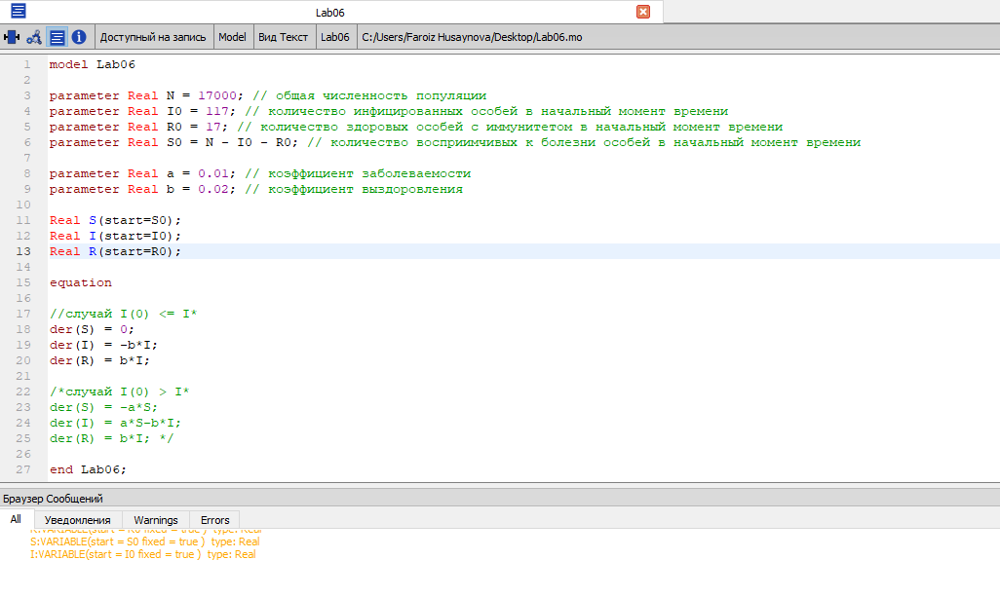
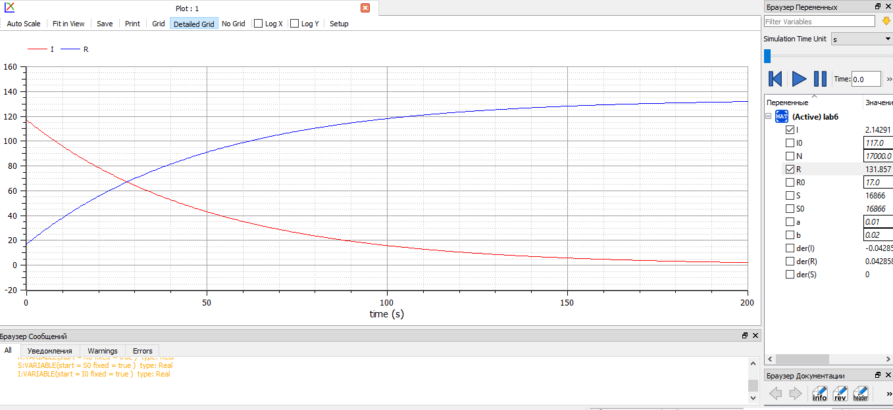
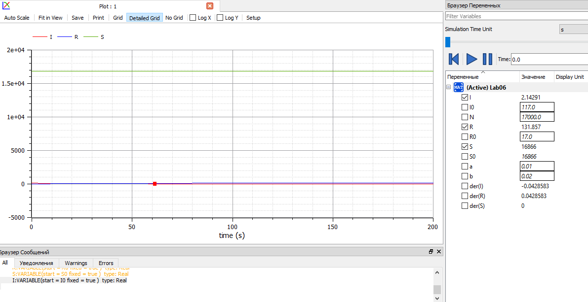
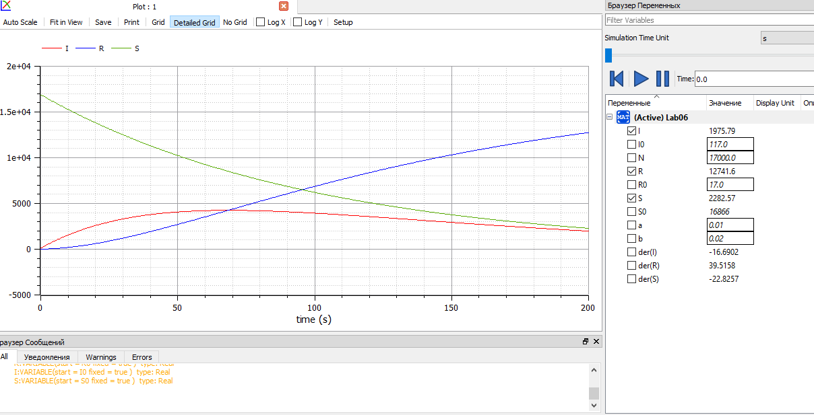

---
# Front matter
lang: ru-RU
title: "Лабораторная работа №6 по математическому моделированию"
subtitle: "Задача об эпидемии"
author: "Хусайнова Фароиз Дилшодовна"

# Formatting
toc-title: "Содержание"
toc: true # Table of contents
toc_depth: 2
lof: true # List of figures
lot: true # List of tables
fontsize: 12pt
linestretch: 1.5
papersize: a4paper
documentclass: scrreprt
polyglossia-lang: russian
polyglossia-otherlangs: english
mainfont: PT Serif
romanfont: PT Serif
sansfont: PT Sans
monofont: PT Mono
mainfontoptions: Ligatures=TeX
romanfontoptions: Ligatures=TeX
sansfontoptions: Ligatures=TeX,Scale=MatchLowercase
monofontoptions: Scale=MatchLowercase
indent: true
pdf-engine: lualatex
header-includes:
  - \linepenalty=10 # the penalty added to the badness of each line within a paragraph (no associated penalty node) Increasing the value makes tex try to have fewer lines in the paragraph.
  - \interlinepenalty=0 # value of the penalty (node) added after each line of a paragraph.
  - \hyphenpenalty=50 # the penalty for line breaking at an automatically inserted hyphen
  - \exhyphenpenalty=50 # the penalty for line breaking at an explicit hyphen
  - \binoppenalty=700 # the penalty for breaking a line at a binary operator
  - \relpenalty=500 # the penalty for breaking a line at a relation
  - \clubpenalty=150 # extra penalty for breaking after first line of a paragraph
  - \widowpenalty=150 # extra penalty for breaking before last line of a paragraph
  - \displaywidowpenalty=50 # extra penalty for breaking before last line before a display math
  - \brokenpenalty=100 # extra penalty for page breaking after a hyphenated line
  - \predisplaypenalty=10000 # penalty for breaking before a display
  - \postdisplaypenalty=0 # penalty for breaking after a display
  - \floatingpenalty = 20000 # penalty for splitting an insertion (can only be split footnote in standard LaTeX)
  - \raggedbottom # or \flushbottom
  - \usepackage{float} # keep figures where there are in the text
  - \floatplacement{figure}{H} # keep figures where there are in the text
---

# Цель работы

Ознакомиться с простейшей моделью Эпидемии и ее построение с помощью языка программирования Modelica.

# Задание

1. Построить графики изменения числа особей в каждой из трех групп по модели SIR.
2. Рассмотреть развитие эпидемии в двух случаях.

# Выполнение лабораторной работы

Предположим, что некая популяция, состоящая из N особей, (считаем, что популяция изолирована) подразделяется на три группы. 

1. $S(t)$ — восприимчивые к болезни, но пока здоровые особи

2. $I(t)$ — это число инфицированных особей, которые также при этом являются распространителями инфекции

3. $R(t)$ — это здоровые особи с иммунитетом к болезни. 

До того, как число заболевших не превышает критического значения $I^*$ считаем, что все больные изолированы и не заражают здоровых. Когда $I(t)>I^*$, тогда инфицирование способны заражать восприимчивых к болезни особей.

Cкорость изменения числа особей, восприимчивых к болезни S(t) меняется по следующему закону:
$$ \frac{dS}{dt} = \begin{cases} -\alpha S, если I(t) > I^* \\ 0, если I(t) \leq I^* \end{cases} $$

Скорость изменения числа инфекционных особей I(t) меняется по следующему закону:
$$ \frac{dI}{dt} = \begin{cases} \alpha S - \beta I, если I(t) > I^* \\ - \beta I, если I(t) \leq I^* \end{cases} $$

Скорость изменения числа выздоравливающих особей R(t) меняется по следующему закону:
$$ \frac{dI}{dt} = \beta I $$

Постоянные пропорциональности:

- $\alpha$ — коэффициент заболеваемости

- $\beta$ — коэффициент выздоровления

Код программы, реализованный на языке программирования Modelica (рис. -@fig:001)  

{ #fig:001 width=70% }

Построим графики, когда $I(0) \leq I^*$ с начальными условиями $I(0)=117, R(0)=17$.
Коэффициенты $\alpha = 0.01, \beta = 0.02$. (рис. -@fig:001)

{ #fig:001 width=70% }

А теперь добавим график изменения числа особей, восприимчивых к болезни S(0)=17000, если число инфицированных не превышает критического значения (рис. -@fig:001)  

{ #fig:001 width=70% }

Теперь же построим графики, когда $I(0) > I^*$ с начальными условиями $I(0)=117, R(0)=17, S(0)=17000$.
Коэффициенты $\alpha = 0.01, \beta = 0.02$. (рис. -@fig:001)

{ #fig:001 width=70% }

# Выводы

При выполнении данной лабораторной работы я ознакомилась с простейшей моделью Эпидемии, построив для нее графики изменения числа особей в трех группах для двух случаев: I(0) \leq I* и I(0) > I*.